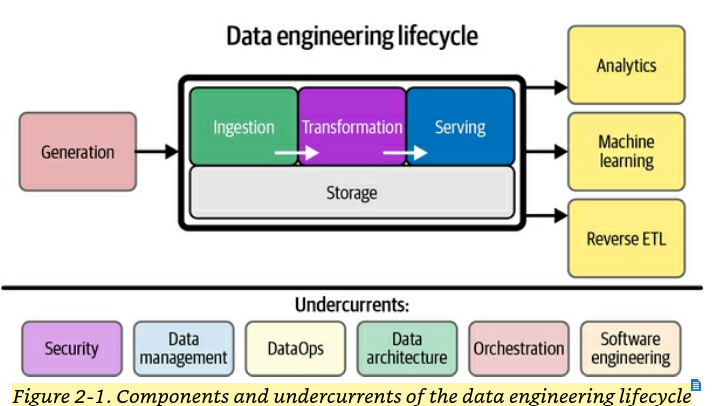

# Car Prices Data Engineering Pipeline

## Project Overview

### Business goal

Purchasing a car is a major financial decision. Determining whether a vehicle is fairly priced, or within your budget, can be difficult. Car prices fluctuate based on brand, model, mileage, condition, location, and external factors such as seasonal demand. I am undertaking this project because I have been car shopping for awhile now and I want to know if cars I am looking at are priced fairly.

Quetions this project aims to answer:

- What are the average car prices by make, model, year, and trim?
- How do prices depreciate over time?
- How does fuel efficiency impact car value?
- Are there seasonal patterns in car prices?

### Analysis approach

This project be an Analytics approach, utilizing a data engineering pipeline to ingest, clean, transform, and analyze car pricing data. The focus will be on descriptive and insight analysis to look at pricing trends.

Key methods include:

- Calculating average and median prices by make, model, year.
- Computing depreciation metrics by comparing used car prices to MSRP.
- Examining seasonal trends in prices across months or quarters.
- Incorporating fuel efficiency data to analyze its effect on value.
- Generating visualizations such as line plots, scatter plots, and aggregated tables for Power BI dashboards

Planned visualizations include line plots and scatter plots in Microsoft PowerBI

### Data sources

#### 1. Used Cars Dataset - Car Price Prediction Dataset (2025)

Overview: Contains detailed information about used cars. Main columns for analysis: Make, Model, Price, and Mileage.

Location: Kaggle, https://www.kaggle.com/datasets/aliiihussain/car-price-prediction

Access: Downloadable as a CSV file; no API access provided.

Usage: Utilized for analysis, including price distribution, depreciation trends.

Technical Details:

- Rows: 2,500
- Columns: 10
- Size: ~160 kB
- Updates expected quarterly

#### 2. New Cars Dataset (MSRP) - CAR DATASET 2025

Overview: Provides modern car specifications and MSRP data, including make, model, year, engine, and MSRP price.

Location: Kaggle, https://www.kaggle.com/datasets/mrjiiiayush/car-dataset-2025

Access: Downloadable directly as a CSV file; no API access provided.

Usage: Provides baseline MSRP values for computing depreciation of used cars. Allows comparison of used car listings with original new car prices.

Technical Details:

- Rows: Does not specify, esitmate ~ 1200
- Columns: 11
- Size: ~ 124 kB
- Updates not specified

#### 3. EPA Fuel Economy API

Overview: Provides authoritative fuel economy, fuel type, and CO2 emissions data for vehicles in the US.

Location: https://www.fueleconomy.gov/feg/ws/index.shtml

Access: API access provided.

Usage: Enrich datasets with fuel efficiency metrics (city/highway/combined MPG). Explore how fuel efficiency affects depreciation or resale value. Incorporate into Power BI dashboards for value vs. efficiency insights.

Technical Deatials:

- Data retrieved via menu-based REST API (year → make → model → options)
- Raw JSON stored in Bronze layer for reproducibility
- Incremental updates can be scheduled for future runs

## Design - Data engineering lifecycle details

This project aligns with the data engineering lifecycle. The lifecycle is the foundation of the book, <u>Fundamentals of Data Engineering</u>, by Joe Ries and Matt Hously. A screenshot of the lifecycle from the book is shown below.

### Architecture and technology choices

This project uses a lakehouse architecture with the medallion pattern (Bronze–Silver–Gold) for clear data organization and processing.

Bronze: Raw CSVs from Kaggle and raw JSON from EPA API

Silver: Cleaned and formatted data with consistent columns and types

Gold: Aggregated data ready for analysis and visualization

Tools Used: Azure Databricks, Azure Data Lake Storage (ADLS), Python, PySpark, Pandas, NumPy, Power BI

### Data storage

Data is stored in a folder structure that mirrors the medallion layers:

## Data Storage Structure

- **/data**
  - **bronze**
    - used_cars/ (raw used car CSVs)
    - new_cars_msrp/ (raw MSRP CSVs)
    - fuel_economy/ (raw EPA API JSON responses)
  - **silver**
    - used_cars_cleaned/ (cleaned & standardized used car data)
    - msrp_cleaned/ (cleaned & standardized MSRP data)
    - fuel_economy_cleaned/ (cleaned & parsed EPA data)
  - **gold**
    - depreciation/ (aggregated depreciation metrics)
    - price_by_age/ (price analysis by vehicle age)
    - fuel_efficiency_analysis/ (analysis combining price and MPG)

### Ingestion

- Retrieval: Download CSVs from Kaggle for used cars and new cars (MSRP). Pull JSON data from the EPA Fuel Economy API.
- Bronze Load: Store all raw CSVs and API responses in Azure Data Lake under the `/data/bronze/` folder. Files are kept immutable to allow historical tracking.
- If a Kaggle dataset updates, a new ingestion run downloads the latest data while preserving previous versions in the Bronze layer for historical comparison.

### Transformation

The transformation layer converts raw, heterogeneous data from Bronze into cleaned, standardized, and analysis-ready datasets in Silver, using Delta Lake format for efficiency, consistency, and ACID compliance.

Steps:

1. Used Cars Dataset (/data/bronze/used_cars/):

- Read raw CSV into Databricks.
- Standardize column names (manufacturer → make, model_year → year, mileage → numeric format).
- Convert data types: year → integer, price → float, mileage → float.
- Handle missing or null values for critical fields (price, year, mileage).
- Store cleaned dataset as Delta Lake in /data/silver/used_cars_cleaned/.

2. New Cars MSRP Dataset (/data/bronze/new_cars_msrp/):

- Read raw CSV.
- Standardize column names (make, model, year, price).
- Ensure all numeric columns (price, engine_cc) are in correct type.
- Store as Delta Lake in /data/silver/msrp_cleaned/.

3. EPA Fuel Economy API (/data/bronze/fuel_economy/):

- Parse raw JSON files from menu-based API.
- Flatten nested fields
- Convert columns to normal data types (city_mpg, highway_mpg, co2_emissions).
- Store cleaned and flattened dataset as Delta Lake in /data/silver/fuel_economy_cleaned/.

4. Aggregation to Gold (/data/gold/):

- Join Silver datasets to compute key metrics:
  - used_cars_cleaned + msrp_cleaned → depreciation
  - used_cars_cleaned + fuel_economy_cleaned → price-per-MPG
- Aggregate by make, model, year.
- Store aggregated tables as Delta Lake in /data/gold/ for Power BI dashboards.

### Serving

The serving layer prepares the transformed Silver and Gold datasets for Power BI analysis and visualization. This involves creating data structures and views that are optimized for reporting.

Steps:

1. Connect to Gold Tables

   - Power BI connects directly to Delta Lake tables in Azure Data Lake (`/data/gold/`).
   - Tables include:
     - `depreciation/` — depreciation metrics by make, model, year, and trim
     - `price_by_age/` — average and median price by vehicle age
     - `fuel_efficiency_analysis/` — price vs. MPG metrics

2. Modeling in Power BI

   - Create relationships between tables.
   - Define calculated columns and measures in Power BI.

3. Visualization
   - Generate interactive dashboards with line charts, scatter plots, and summary tables.
   - Examples:
     - Depreciation trends over vehicle age
     - Price distribution by make and model
     - Fuel efficiency impact on resale value

## Undercurrents

1. Data Management

- What it is: Ensuring data is clean, reliable, and traceable.
- Why it matters: You are combining multiple sources (used cars, MSRP, fuel economy) that may have inconsistent formats or missing data.
- How it’s handled:
  - Standardize columns and types in the Silver layer.
  - Keep raw data in Bronze for historical reference.
  - Track data lineage and document sources and transformations.

2. Data Architecture

- What it is: Organizing and storing data efficiently across the pipeline.
- Why it matters: Proper architecture ensures fast querying, reproducibility, and easy access for Power BI dashboards.
- How it’s handled:
  - Use the medallion pattern (Bronze -> Silver -> Gold).
  - Store data in Delta Lake for consistency and performance.
  - Partition tables by year or make to optimize dashboard queries.

## Implementation

### Navigating the repo

- src/ingestion/: Scripts for data ingestion

- src/transformation/: PySpark jobs and notebooks

- src/serving/: Power BI assets

### Reproduction steps

The following steps describe how to fully reproduce this project in a new Azure environment.

1. Fork and Clone the Repository

- Fork this repository to your own GitHub account

- Clone the repository locally or import it directly into Azure Databricks

2. Create Azure Resources

- Create an Azure Blob Storage account

- Create a blob container (e.g., car-prices-data)

- Create an Azure Databricks Workspace and a cluster with PySpark support

- Configure Databricks access to Blob Storage using account keys or SAS tokens

3. Open the Project in Databricks

- Import the repository into Databricks

- Verify ingestion and transformation notebooks load successfully

4. Download Source Datasets

- Download the following CSV datasets from Kaggle:

  - Used Cars Dataset – Car Price Prediction Dataset (2025)

  - New Cars Dataset (MSRP) – Car Dataset 2025

5. Upload Raw Data to Blob Storage (Bronze Layer)

- Upload the CSV files to Azure Blob Storage:

  /data/bronze/used_cars/
  /data/bronze/new_cars_msrp/

6. Configure Environment-Specific Paths

- Update storage URIs, container names, and endpoints in ingestion and transformation scripts to match your Azure environment

7. Run Ingestion Scripts

- Execute ingestion notebooks/scripts to validate and load raw data into the Bronze layer

- Retrieve and store EPA Fuel Economy API JSON responses in: /data/bronze/fuel_economy/

8. Run Transformation Scripts

- Execute Bronze → Silver transformations to clean and standardize datasets

- Execute Silver → Gold transformations to generate aggregated analytics tables

- All outputs are stored as Delta tables (gold is csv and delta table if you have a preference for connecting to Power BI) under /data/silver/ and /data/gold/

9. Open Power BI Report (Serving Layer)

- Open the Power BI .pbix file located in the serving/ directory

- Update data source connections to point to Gold-layer tables in Azure Blob Storage

- Refresh the report to populate dashboards

10. Validate Results

- Confirm Gold tables are populated

- Verify dashboards render correctly and answer the stated business questions
